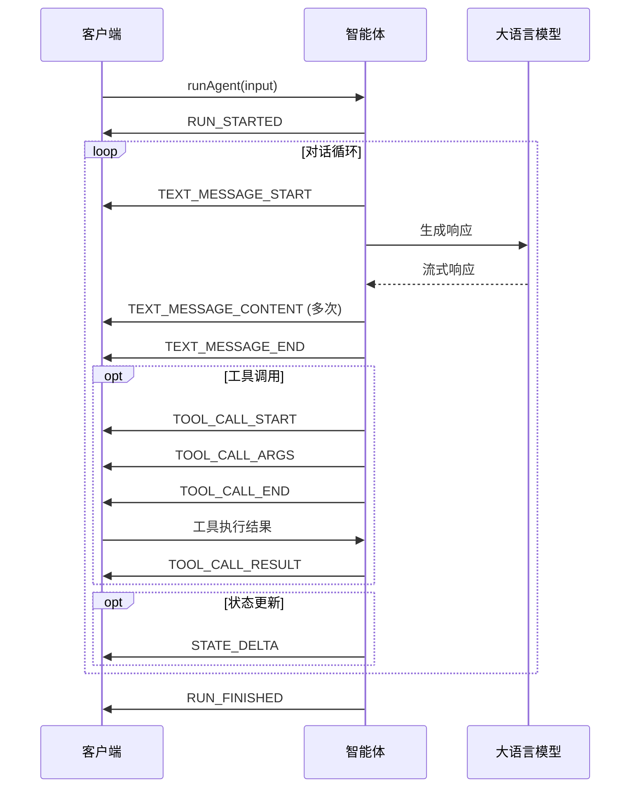

# AG-UI 源码深度分析

## 概述

AG-UI（Agent-User Interaction Protocol）是一个开源的、轻量级的、基于事件的协议，用于标准化 AI 智能体与前端应用程序之间的通信。它是智能体生态系统中专门负责人机交互层的协议。

## 仓库结构

```
ag-ui/
├── typescript-sdk/          # TypeScript 主要实现
│   ├── packages/            # 核心包
│   │   ├── core/           # 核心事件和类型定义
│   │   ├── client/         # 客户端实现
│   │   ├── encoder/        # 编码器
│   │   └── proto/          # 协议定义
│   ├── integrations/       # 各种框架集成
│   │   ├── langgraph/      # LangGraph 集成
│   │   ├── mastra/         # Mastra 集成
│   │   ├── crewai/         # CrewAI 集成
│   │   └── ...
│   └── apps/               # 应用示例
├── python-sdk/             # Python SDK 实现
├── docs/                   # 文档
└── README.md
```

## 核心架构设计

### 1. 事件驱动架构

AG-UI 的核心是一个**事件驱动的流式协议**，定义了 16+ 种标准化事件类型：

#### 生命周期事件
- `RUN_STARTED` - 智能体运行开始
- `RUN_FINISHED` - 智能体运行完成  
- `RUN_ERROR` - 智能体运行错误
- `STEP_STARTED` - 步骤开始
- `STEP_FINISHED` - 步骤完成

#### 文本消息事件
- `TEXT_MESSAGE_START` - 文本消息开始
- `TEXT_MESSAGE_CONTENT` - 文本消息内容（流式）
- `TEXT_MESSAGE_END` - 文本消息结束
- `TEXT_MESSAGE_CHUNK` - 文本消息块

#### 工具调用事件
- `TOOL_CALL_START` - 工具调用开始
- `TOOL_CALL_ARGS` - 工具调用参数
- `TOOL_CALL_END` - 工具调用结束
- `TOOL_CALL_RESULT` - 工具调用结果

#### 状态管理事件
- `STATE_SNAPSHOT` - 状态快照
- `STATE_DELTA` - 状态增量（JSON Patch）
- `MESSAGES_SNAPSHOT` - 消息历史快照

#### 特殊事件
- `THINKING_START/END` - 思考过程
- `RAW` - 原始事件
- `CUSTOM` - 自定义事件

### 2. 核心抽象

#### AbstractAgent 基类
```typescript
export abstract class AbstractAgent {
  protected abstract run(input: RunAgentInput): Observable<BaseEvent>;
  
  public async runAgent(parameters?: RunAgentParameters): Promise<RunAgentResult>;
}
```

这是所有智能体实现的基础，定义了：
- 输入：`RunAgentInput`（包含线程ID、消息、工具、上下文）
- 输出：`Observable<BaseEvent>`（事件流）

#### 消息类型系统
```typescript
type Message = 
  | DeveloperMessage    // 开发者消息
  | SystemMessage       // 系统消息  
  | AssistantMessage    // 助手消息
  | UserMessage         // 用户消息
  | ToolMessage         // 工具消息
```

### 3. 客户端架构

#### HttpAgent
标准 HTTP 客户端，支持多种传输方式：
- **Server-Sent Events (SSE)** - 文本流式传输
- **Binary Protocol** - 高性能二进制传输

#### 事件处理管道
```
事件流 → 验证 → 转换 → 应用 → 订阅者回调
```

1. **验证**（Verify）：确保事件格式正确
2. **转换**（Transform）：事件格式适配和处理
3. **应用**（Apply）：更新客户端状态
4. **订阅**（Subscribe）：触发用户回调

## 设计理念

### 1. 简洁性（Simplicity）
- **轻量级协议**：最小化的事件格式和通信开销
- **清晰的抽象**：简单的 `run()` 接口，返回事件流
- **少即是多**：16个核心事件类型覆盖大部分用例

### 2. 灵活性（Flexibility）
- **传输无关**：支持 SSE、WebSocket、HTTP、Webhook 等
- **宽松匹配**：事件不需要完全匹配 AG-UI 格式，只需兼容
- **中间件层**：支持自定义事件转换和处理

### 3. 互操作性（Interoperability）
- **框架无关**：可与任何智能体框架集成
- **语言无关**：提供 TypeScript 和 Python SDK
- **标准化**：统一的事件和消息格式

### 4. 实时性（Real-time）
- **流式传输**：支持渐进式内容更新
- **低延迟**：事件驱动的即时响应
- **状态同步**：实时的双向状态同步

### 5. 类型安全（Type Safety）
- **强类型**：使用 Zod（TypeScript）和 Pydantic（Python）验证
- **编译时检查**：TypeScript 提供完整的类型推导
- **运行时验证**：确保事件格式正确性

## 核心逻辑流程

### 1. 智能体执行流程


### 2. 状态管理机制
- **快照模式**：完整状态传输（`STATE_SNAPSHOT`）
- **增量模式**：JSON Patch 增量更新（`STATE_DELTA`）
- **消息同步**：对话历史同步（`MESSAGES_SNAPSHOT`）

### 3. 错误处理
- **错误事件**：`RUN_ERROR` 传递错误信息
- **优雅降级**：部分失败不影响整体流程
- **重试机制**：客户端可实现重试逻辑

## 框架集成分析

### LangGraph 集成
```typescript
export class LangGraphAgent extends AbstractAgent {
  protected run(input: RunAgentInput): Observable<BaseEvent> {
    // 1. 创建 LangGraph 客户端
    // 2. 启动图执行
    // 3. 监听 LangGraph 事件
    // 4. 转换为 AG-UI 事件
  }
}
```

### 集成策略
1. **事件映射**：将框架原生事件映射到 AG-UI 事件
2. **状态同步**：同步框架状态到 AG-UI 状态
3. **工具桥接**：统一工具调用接口
4. **错误处理**：统一错误格式

## 技术特点

### 1. 响应式编程
- 使用 **RxJS Observable** 处理事件流
- 支持背压控制和错误恢复
- 函数式编程范式

### 2. 类型系统
```typescript
// 事件的判别联合类型
type AGUIEvent = 
  | TextMessageStartEvent
  | TextMessageContentEvent  
  | ToolCallStartEvent
  | StateSnapshotEvent
  | ...
```

### 3. 中间件架构
```typescript
const pipeline = pipe(
  verifyEvents,           // 验证事件
  transformChunks,        // 转换事件块
  defaultApplyEvents,     // 应用事件到状态
  runSubscribersWithMutation // 触发订阅者
);
```

## 与其他协议的关系

AG-UI 在智能体协议栈中的定位：

```
┌─────────────────┐
│   前端应用      │
├─────────────────┤
│     AG-UI       │ ← 人机交互层
├─────────────────┤  
│   智能体框架    │
├─────────────────┤
│      A2A        │ ← 智能体间通信
├─────────────────┤
│      MCP        │ ← 工具调用协议  
├─────────────────┤
│   大语言模型    │
└─────────────────┘
```

- **AG-UI**：负责智能体与用户的交互
- **A2A**：负责智能体之间的通信  
- **MCP**：负责模型与工具的交互

## 性能优化

### 1. 二进制协议
- 自定义二进制序列化格式
- 减少网络传输开销
- 提高解析性能

### 2. 事件合并
```typescript
// 将多个文本内容事件合并
TEXT_MESSAGE_CONTENT + TEXT_MESSAGE_CONTENT 
→ TEXT_MESSAGE_CHUNK
```

### 3. 状态增量更新
使用 JSON Patch (RFC 6902) 进行增量状态更新，减少数据传输量。

## 扩展性设计

### 1. 自定义事件
```typescript
interface CustomEvent {
  type: 'CUSTOM';
  name: string;    // 自定义事件名
  value: any;      // 自定义数据
}
```

### 2. 插件架构
- 事件转换插件
- 状态管理插件  
- 传输层插件

### 3. 协议版本管理
- 向后兼容的事件格式
- 可选字段渐进式增强
- 优雅的协议升级

## 开发工具

### 1. AG-UI Dojo
构建块查看器，展示各种 AG-UI 功能的实现示例，每个示例 50-200 行代码。

### 2. 调试支持
- 原始事件保留（`rawEvent` 字段）
- 详细的类型检查错误
- 事件流可视化

### 3. 脚手架工具
```bash
npx create-ag-ui-app my-agent-app
```

## 总结

AG-UI 的核心价值在于：

1. **标准化**：为智能体-用户交互提供统一的协议标准
2. **简洁性**：以最小的复杂度实现最大的功能覆盖
3. **灵活性**：适配各种传输方式和智能体框架
4. **实用性**：专注解决实际的人机交互问题
5. **可扩展性**：为未来的需求演进提供扩展空间

这种设计使得 AG-UI 能够成为连接智能体生态系统与用户界面的桥梁，为构建下一代智能应用提供强有力的基础设施支持。

## 核心创新点

1. **事件驱动的实时通信**：相比传统的请求-响应模式，事件流能更好地支持智能体的异步、多步骤执行
2. **宽松的兼容性设计**：不要求严格的事件格式匹配，降低了集成门槛
3. **分层的抽象架构**：核心协议 + 传输层 + 框架适配，各层职责清晰
4. **类型安全的流式处理**：结合 TypeScript 类型系统与响应式编程，确保运行时的安全性

这些设计决策体现了 AG-UI 团队对智能体应用开发痛点的深刻理解，以及对协议简洁性和实用性的追求。