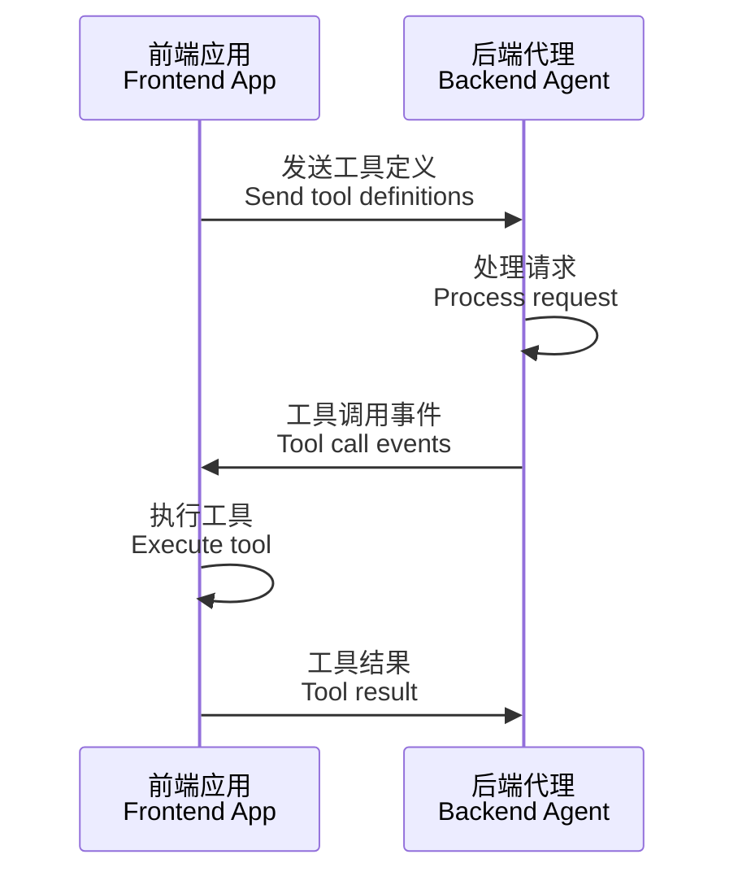
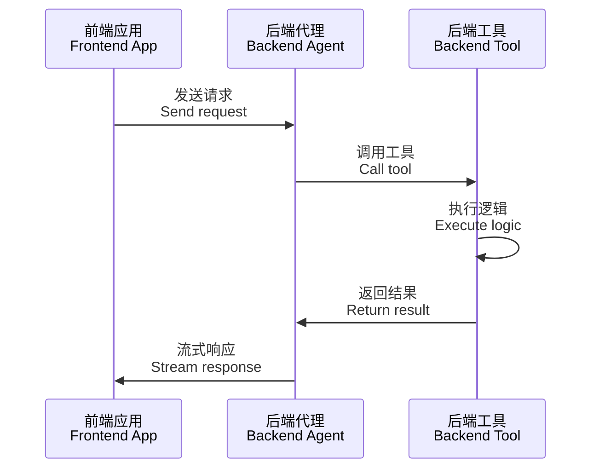
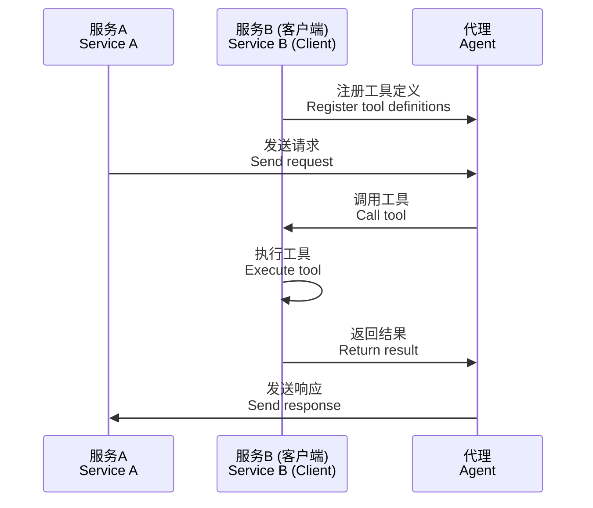

# Tool Definition Patterns | 工具定义模式

AG-UI 协议支持灵活的工具定义模式，允许在前端、后端或两者之间定义和使用工具。本文档将详细介绍这些模式以及它们的实现方式。

The AG-UI protocol supports flexible tool definition patterns, allowing tools to be defined and used on the frontend, backend, or both. This document explains these patterns and their implementations in detail.

## 概述 | Overview

AG-UI 支持三种主要的工具定义模式 | AG-UI supports three main tool definition patterns:

1. **前端定义工具 | Frontend-Defined Tools**: 工具在前端应用中定义，传递给后端代理执行 | Tools defined in frontend applications and passed to backend agents for execution
2. **后端定义工具 | Backend-Defined Tools**: 工具在后端代理中定义和执行 | Tools defined and executed within backend agents
3. **服务端作为客户端 | Server-as-Client**: 后端服务作为客户端来定义工具给其他代理使用 | Backend services acting as clients to define tools for other agents

## 模式一：前端定义工具 | Pattern 1: Frontend-Defined Tools

这是 AG-UI 的标准模式，工具在前端定义并传递给后端代理。

This is the standard AG-UI pattern where tools are defined in the frontend and passed to backend agents.

### 架构流程 | Architecture Flow



### TypeScript 前端示例 | TypeScript Frontend Example

```typescript
// tools/weather.tool.ts
import { createTool } from "@mastra/core/tools";
import { z } from "zod";

export const weatherTool = createTool({
  id: "get-weather",
  description: "获取指定位置的当前天气 | Get current weather for a location",
  inputSchema: z.object({
    location: z.string().describe("城市名称 | City name"),
  }),
  outputSchema: z.object({
    temperature: z.number(),
    feelsLike: z.number(),
    humidity: z.number(),
    conditions: z.string(),
    location: z.string(),
  }),
  execute: async ({ context }) => {
    // 在前端执行工具逻辑 | Execute tool logic on frontend
    return await getWeather(context.location);
  },
});

// agent.ts
import { MastraAgent } from "@ag-ui/mastra";
import { weatherTool } from "./tools/weather.tool";

export const agent = new MastraAgent({
  agent: new Agent({
    name: "Weather Assistant",
    instructions: "帮助用户获取天气信息 | Help users get weather information",
    model: openai("gpt-4o-mini"),
    tools: { weatherTool }, // 工具在前端定义 | Tools defined on frontend
  }),
  threadId: "1",
});
```

### React 前端示例 | React Frontend Example

```tsx
import { useCopilotAction } from "@copilotkit/react-core";

// 在 React 组件中定义工具 | Define tools in React components
export function WeatherComponent() {
  useCopilotAction({
    name: "confirmWeatherAction",
    description: "请求用户确认天气相关操作 | Ask user to confirm weather-related action",
    parameters: {
      type: "object",
      properties: {
        action: {
          type: "string",
          description: "需要确认的操作 | Action to confirm",
        },
        location: {
          type: "string", 
          description: "位置信息 | Location information",
        },
      },
      required: ["action"],
    },
    handler: async ({ action, location }) => {
      // 前端处理工具调用 | Frontend handles tool execution
      const confirmed = await showConfirmDialog(`${action} for ${location}?`);
      return confirmed ? "已确认 | Confirmed" : "已取消 | Cancelled";
    },
  });

  return <div>Weather Component</div>;
}
```

### 特点和优势 | Characteristics and Benefits

**前端控制 | Frontend Control**: 前端应用控制可用的工具能力 | Frontend app controls available tool capabilities
**动态能力 | Dynamic Capabilities**: 可以根据用户权限、上下文或应用状态添加或移除工具 | Tools can be added/removed based on user permissions, context, or app state
**安全性 | Security**: 敏感操作由应用控制，而非代理 | Sensitive operations controlled by application, not agent
**用户交互 | User Interaction**: 直接支持人机交互工作流程 | Direct support for human-in-the-loop workflows

## 模式二：后端定义工具 | Pattern 2: Backend-Defined Tools

工具在后端代理中定义和执行，通常用于服务器端操作或计算密集型任务。

Tools are defined and executed within backend agents, typically for server-side operations or compute-intensive tasks.

### 架构流程 | Architecture Flow



### Python 后端示例 | Python Backend Example

```python
# LangGraph 后端工具定义 | LangGraph backend tool definition
from langchain_core.tools import tool
from langgraph.graph import StateGraph, MessagesState

# 在后端定义工具 | Define tools on backend
GENERATE_HAIKU_TOOL = {
    "type": "function",
    "function": {
        "name": "generate_haiku",
        "description": "生成日语俳句及其英语翻译 | Generate a haiku in Japanese and its English translation",
        "parameters": {
            "type": "object",
            "properties": {
                "japanese": {
                    "type": "array",
                    "items": {"type": "string"},
                    "description": "日语俳句的三行 | Three lines of haiku in Japanese"
                },
                "english": {
                    "type": "array", 
                    "items": {"type": "string"},
                    "description": "英语俳句的三行 | Three lines of haiku in English"
                }
            },
            "required": ["japanese", "english"]
        }
    }
}

@tool
def generate_haiku_backend(topic: str) -> dict:
    """后端俳句生成工具 | Backend haiku generation tool"""
    # 在服务器上执行复杂逻辑 | Execute complex logic on server
    return {
        "japanese": ["春の雨", "桜散りゆく", "静寂かな"],
        "english": ["Spring rain falls", "Cherry blossoms drift away", "Silence remains"]
    }

# 代理配置 | Agent configuration
class AgentState(MessagesState):
    tools: List[Any]

async def chat_node(state: AgentState, config: RunnableConfig):
    model = ChatOpenAI(model="gpt-4o")
    
    # 绑定后端定义的工具 | Bind backend-defined tools
    model_with_tools = model.bind_tools([GENERATE_HAIKU_TOOL])
    
    response = await model_with_tools.ainvoke(state["messages"], config)
    
    return Command(goto=END, update={"messages": state["messages"] + [response]})
```

### TypeScript 后端示例 | TypeScript Backend Example

```typescript
// 服务器端工具定义 | Server-side tool definition
export class BackendToolServer {
  private tools = new Map<string, Tool>();

  constructor() {
    // 在服务器启动时定义工具 | Define tools at server startup
    this.registerTool({
      name: "processLargeDataset",
      description: "处理大型数据集 | Process large dataset",
      parameters: {
        type: "object",
        properties: {
          dataUrl: {
            type: "string",
            description: "数据集URL | Dataset URL"
          },
          operation: {
            type: "string",
            enum: ["analyze", "transform", "summarize"],
            description: "操作类型 | Operation type"
          }
        },
        required: ["dataUrl", "operation"]
      }
    });
  }

  private registerTool(tool: Tool) {
    this.tools.set(tool.name, tool);
  }

  async handleToolCall(toolName: string, args: any): Promise<any> {
    const tool = this.tools.get(toolName);
    if (!tool) {
      throw new Error(`工具未找到 | Tool not found: ${toolName}`);
    }

    // 在后端执行工具逻辑 | Execute tool logic on backend
    switch (toolName) {
      case "processLargeDataset":
        return await this.processLargeDataset(args);
      default:
        throw new Error(`未实现的工具 | Unimplemented tool: ${toolName}`);
    }
  }

  private async processLargeDataset(args: { dataUrl: string; operation: string }) {
    // 服务器端密集计算 | Server-side intensive computation
    return {
      status: "completed",
      result: "数据处理完成 | Data processing completed",
      processedRows: 1000000
    };
  }
}
```

### 特点和优势 | Characteristics and Benefits

**服务器资源 | Server Resources**: 利用服务器的计算能力和资源 | Leverage server computing power and resources
**数据安全 | Data Security**: 敏感数据不离开服务器环境 | Sensitive data never leaves server environment
**性能优化 | Performance**: 避免客户端性能限制 | Avoid client-side performance limitations
**集中管理 | Centralized Management**: 工具逻辑集中维护 | Centralized tool logic maintenance

## 模式三：服务端作为客户端 | Pattern 3: Server-as-Client

后端服务可以作为客户端来定义工具，并将这些工具提供给其他代理或服务使用。

Backend services can act as clients to define tools and provide them to other agents or services.

### 架构流程 | Architecture Flow



### 微服务工具提供者示例 | Microservice Tool Provider Example

```typescript
// 工具提供服务 | Tool Provider Service
export class ToolProviderService {
  private agClient: AgUiClient;

  constructor(agentEndpoint: string) {
    this.agClient = new AgUiClient(agentEndpoint);
  }

  async registerToolsWithAgent() {
    // 服务端作为客户端注册工具 | Server acting as client to register tools
    const tools = [
      {
        name: "sendNotification",
        description: "发送通知给用户 | Send notification to user",
        parameters: {
          type: "object",
          properties: {
            userId: {
              type: "string",
              description: "用户ID | User ID"
            },
            message: {
              type: "string", 
              description: "通知消息 | Notification message"
            },
            priority: {
              type: "string",
              enum: ["low", "medium", "high"],
              description: "优先级 | Priority level"
            }
          },
          required: ["userId", "message"]
        }
      },
      {
        name: "queryDatabase",
        description: "查询数据库 | Query database",
        parameters: {
          type: "object",
          properties: {
            table: {
              type: "string",
              description: "表名 | Table name"
            },
            filters: {
              type: "object",
              description: "查询过滤器 | Query filters"
            }
          },
          required: ["table"]
        }
      }
    ];

    // 向代理注册工具 | Register tools with agent
    await this.agClient.registerTools(tools, {
      onToolCall: this.handleToolCall.bind(this)
    });
  }

  private async handleToolCall(toolName: string, args: any): Promise<any> {
    switch (toolName) {
      case "sendNotification":
        return await this.sendNotification(args);
      case "queryDatabase":
        return await this.queryDatabase(args);
      default:
        throw new Error(`未知工具 | Unknown tool: ${toolName}`);
    }
  }

  private async sendNotification(args: { userId: string; message: string; priority?: string }) {
    // 实际的通知发送逻辑 | Actual notification sending logic
    return {
      status: "sent",
      notificationId: "notif_123",
      message: "通知已发送 | Notification sent"
    };
  }

  private async queryDatabase(args: { table: string; filters?: any }) {
    // 实际的数据库查询逻辑 | Actual database query logic
    return {
      results: [],
      count: 0,
      message: "查询完成 | Query completed"
    };
  }
}

// 启动工具提供服务 | Start tool provider service
const toolProvider = new ToolProviderService("http://agent-service:8000");
await toolProvider.registerToolsWithAgent();
```

### Python 服务端客户端示例 | Python Server-Client Example

```python
# 工具提供服务 | Tool Provider Service
import asyncio
from typing import Dict, Any, Callable
from ag_ui.client import AgUiClient

class DatabaseToolProvider:
    """数据库工具提供者 | Database tool provider"""
    
    def __init__(self, agent_endpoint: str):
        self.client = AgUiClient(agent_endpoint)
        self.tools = self._define_tools()
    
    def _define_tools(self) -> list:
        """定义可用的工具 | Define available tools"""
        return [
            {
                "name": "execute_query",
                "description": "执行数据库查询 | Execute database query",
                "parameters": {
                    "type": "object",
                    "properties": {
                        "sql": {
                            "type": "string",
                            "description": "SQL查询语句 | SQL query statement"
                        },
                        "database": {
                            "type": "string",
                            "description": "数据库名称 | Database name"
                        }
                    },
                    "required": ["sql", "database"]
                }
            },
            {
                "name": "backup_database",
                "description": "备份数据库 | Backup database",
                "parameters": {
                    "type": "object",
                    "properties": {
                        "database": {
                            "type": "string",
                            "description": "要备份的数据库 | Database to backup"
                        },
                        "location": {
                            "type": "string",
                            "description": "备份位置 | Backup location"
                        }
                    },
                    "required": ["database"]
                }
            }
        ]
    
    async def register_with_agent(self):
        """向代理注册工具 | Register tools with agent"""
        await self.client.register_tools(
            tools=self.tools,
            handler=self.handle_tool_call
        )
    
    async def handle_tool_call(self, tool_name: str, args: Dict[str, Any]) -> Any:
        """处理工具调用 | Handle tool calls"""
        if tool_name == "execute_query":
            return await self._execute_query(args)
        elif tool_name == "backup_database":
            return await self._backup_database(args)
        else:
            raise ValueError(f"未知工具 | Unknown tool: {tool_name}")
    
    async def _execute_query(self, args: Dict[str, Any]) -> Dict[str, Any]:
        """执行数据库查询 | Execute database query"""
        # 实际的数据库操作逻辑 | Actual database operation logic
        return {
            "status": "success",
            "rows_affected": 42,
            "message": "查询执行成功 | Query executed successfully"
        }
    
    async def _backup_database(self, args: Dict[str, Any]) -> Dict[str, Any]:
        """备份数据库 | Backup database"""
        # 实际的备份逻辑 | Actual backup logic
        return {
            "status": "completed",
            "backup_file": f"/backups/{args['database']}_backup.sql",
            "message": "数据库备份完成 | Database backup completed"
        }

# 启动服务 | Start service
async def main():
    provider = DatabaseToolProvider("http://agent-service:8000")
    await provider.register_with_agent()
    
    # 保持服务运行 | Keep service running
    while True:
        await asyncio.sleep(60)

if __name__ == "__main__":
    asyncio.run(main())
```

### 特点和优势 | Characteristics and Benefits

**服务解耦 | Service Decoupling**: 不同服务可以独立提供工具能力 | Different services can independently provide tool capabilities
**可扩展性 | Scalability**: 易于添加新的工具提供者 | Easy to add new tool providers
**专业化 | Specialization**: 每个服务专注于特定域的工具 | Each service focuses on domain-specific tools
**动态注册 | Dynamic Registration**: 运行时动态注册和注销工具 | Dynamic tool registration/deregistration at runtime

## 工具定义最佳实践 | Tool Definition Best Practices

### 设计原则 | Design Principles

1. **清晰命名 | Clear Naming**: 使用描述性的、面向操作的名称 | Use descriptive, action-oriented names
2. **详细描述 | Detailed Descriptions**: 提供双语描述帮助代理理解何时和如何使用工具 | Provide bilingual descriptions to help agents understand when and how to use tools
3. **结构化参数 | Structured Parameters**: 定义精确的参数模式 | Define precise parameter schemas
4. **错误处理 | Error Handling**: 实现强健的错误处理 | Implement robust error handling

### 示例：完整的工具定义 | Example: Complete Tool Definition

```typescript
// 完整的双语工具定义示例 | Complete bilingual tool definition example
export const confirmActionTool = {
  name: "confirmAction",
  description: `
    请求用户确认特定操作。在执行重要或不可逆操作之前使用此工具。
    Ask the user to confirm a specific action. Use this tool before executing important or irreversible operations.
  `,
  parameters: {
    type: "object",
    properties: {
      action: {
        type: "string",
        description: "需要用户确认的操作描述 | Description of the action that needs user confirmation"
      },
      importance: {
        type: "string",
        enum: ["low", "medium", "high", "critical"],
        description: "操作的重要性级别 | Importance level of the action"
      },
      consequences: {
        type: "string",
        description: "执行此操作的后果说明 | Description of consequences of executing this action"
      },
      alternatives: {
        type: "array",
        items: { type: "string" },
        description: "可选的替代操作 | Optional alternative actions"
      }
    },
    required: ["action", "importance"]
  }
};
```

## 工具调用生命周期 | Tool Call Lifecycle

无论使用哪种模式，工具调用都遵循相同的事件序列：

Regardless of the pattern used, tool calls follow the same event sequence:

```typescript
// 1. 工具调用开始 | Tool call start
{
  type: EventType.TOOL_CALL_START,
  toolCallId: "tool-123",
  toolCallName: "confirmAction",
  parentMessageId: "msg-456"
}

// 2. 工具参数流式传输 | Tool arguments streaming
{
  type: EventType.TOOL_CALL_ARGS,
  toolCallId: "tool-123", 
  delta: '{"action":"Deploy application",'
}

// 3. 工具调用结束 | Tool call end
{
  type: EventType.TOOL_CALL_END,
  toolCallId: "tool-123"
}

// 4. 工具结果消息 | Tool result message
{
  id: "result-789",
  role: "tool",
  content: "用户已确认部署 | User confirmed deployment",
  toolCallId: "tool-123"
}
```

## 选择合适的模式 | Choosing the Right Pattern

| 场景 | 推荐模式 | 原因 |
|------|----------|------|
| 用户交互确认 | 前端定义 | 需要直接用户界面交互 |
| 数据处理 | 后端定义 | 计算密集型，需要服务器资源 |
| 微服务架构 | 服务端作为客户端 | 解耦服务，专业化工具 |
| 实时协作 | 前端定义 | 需要实时用户反馈 |
| 安全操作 | 后端定义 | 敏感操作需要服务器端控制 |

| Scenario | Recommended Pattern | Reason |
|----------|-------------------|---------|
| User interaction confirmation | Frontend-defined | Requires direct UI interaction |
| Data processing | Backend-defined | Compute-intensive, needs server resources |
| Microservice architecture | Server-as-client | Decoupled services, specialized tools |
| Real-time collaboration | Frontend-defined | Needs real-time user feedback |
| Security operations | Backend-defined | Sensitive operations need server-side control |

## 总结 | Summary

AG-UI 协议的灵活工具定义系统支持多种架构模式，从简单的前端工具到复杂的分布式工具生态系统。选择合适的模式取决于您的具体用例、安全要求和架构约束。

The AG-UI protocol's flexible tool definition system supports various architectural patterns, from simple frontend tools to complex distributed tool ecosystems. Choose the appropriate pattern based on your specific use case, security requirements, and architectural constraints.

通过理解这些模式，您可以构建既强大又灵活的 AI 驱动应用程序，充分利用人机协作的优势。

By understanding these patterns, you can build powerful and flexible AI-driven applications that leverage the best of human-AI collaboration.